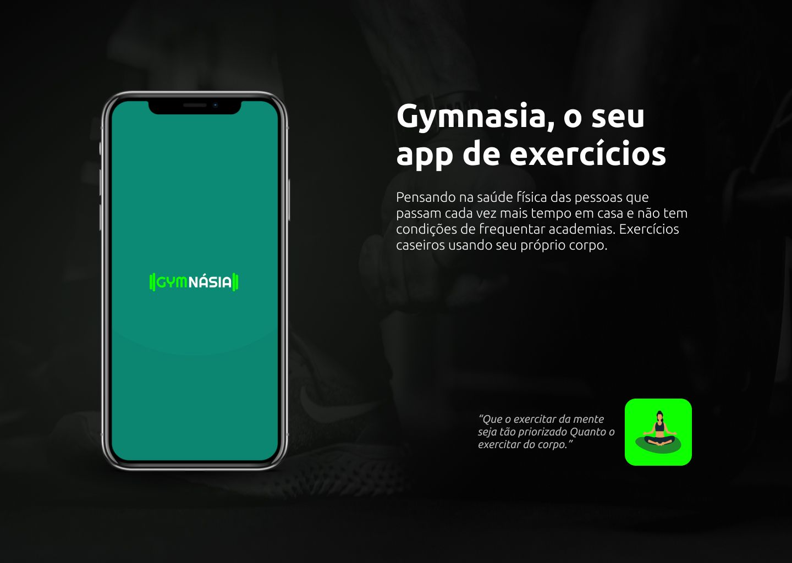

# Gymnasia - App de Exercícios

### SOBRE
Um aplicativo desenvolvido com React Native para Trabalho de Conclusão de Curso de Técnico em Desenvolvimento de Sistemas na Etec Sebastiana Augusta de Moraes: Extensão Noêmia Dias Perotti. Ele integra diferentes bibliotecas para permitir a prática de treinos, lembretes e criação de treinos personalizados pelo usuário;



----------------------------
#### NECESSÁRIO
* Gerenciador de pacotes como o [Yarn](https://classic.yarnpkg.com/en/docs/install/) ou [Npm](https://www.npmjs.com/get-npm);
* Expo 4.10.* ou posterior;
```  bash
$ npm install --global expo-cli
$ yarn global add expo-cli
 ```
 
* Credenciais do [Google OAuth](https://console.cloud.google.com/apis/credentials) para usar login com Google;
* Um Projeto no [Firebase](https://firebase.google.com/) para usar Autenticação e Firestore (Autenticação Anônima, Email/Senha e Google);
* Simulador Android/IOS, ou um celular com  o Expo Go na [Google Play](https://play.google.com/store/apps/details?id=host.exp.exponent&hl=pt_BR&gl=US)  ou [AppStore](https://apps.apple.com/br/app/expo-go/id982107779)
* Editor de código como o [Visual Studios Code](https://code.visualstudio.com/) ou de sua preferência (Opcional);
----------------------------
#### INSTALAÇÃO LOCAL
Para instalar e iniciar o aplicativo localmente usando Expo:
``` bash
$ git clone https://github.com/DanielVitorSM/gymnasia
$ cd plant-manager/
#! Configure a app.json corretamente colocando as informações do firebase
$ yarn install ou npm install
$ expo start
```
----------------------------
#### MAIS INFORMAÇÕES
Daniel Vitor Silva Moreira  
contato.danielsmoreira@gmail.com 

#### LINKS
https://instagram.com/danielvitorsm  
https://www.linkedin.com/in/danielvitorsm  